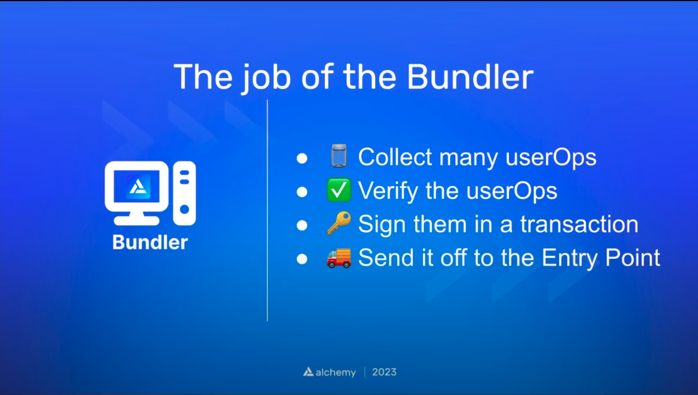

## The five roles of ERC 4337
1. User
2. Bundler
3. Entry Point
4. Paymaster
5. Smart Contract Account

- User and Bundler will contain keys
- User's key is going to be an authentication key that will be verified in the smart contract account
  
- Then we have 3 smart contracts
- Entry Point
- Paymaster
- Smart Contract Account

- The main goal of AA is
  - Instead of EOA making state changes
  - Make smart contract account to make the state changes

### User & Bundler

- The tx fields will be slightly different comparing to a tx sent by a EOA
- data: calldata
- nonce: to prevent replay attacks
- initCode: To initialize smart contract account if it not initialized
- Sender: Smart account which sends the calldata
- gasParams: same as EOA tx
- paymasterInfo: info about paymaster(who is sponsoring gas for this tx)

- Many AA users can send many User Operations to the Bundler
- Bundler will sign all this User Operations inside of on tx
  

- Bundker will simulate each UserOp and check what will happen if it played on chain
  - It will mainly check whether paymaster is specified
  - Whether this is a valid transaction

### Executing the Ops

- After the simulation
- Bundler will execute the valid UserOps and submit the transaction
- For each of these userOp
- `entryPoint` will verify whether this a valid userOp
- whether paymaster has approved to sponsor gas
- Then it will call the `smart contract account` to execute the transaction
- PosOp will check whether paymaster has enough gas for this tx or whether smart contract paid for the gas

